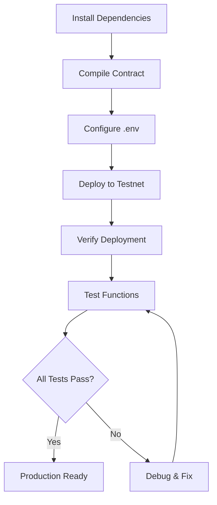

# The Hollows Treasury - Complete Project Index

## 🎯 Quick Start

**New to the project?** Start here:
1. Read [`PROJECT_SUMMARY.md`](PROJECT_SUMMARY.md) - High-level overview
2. Read [`QUICKSTART.md`](QUICKSTART.md) - Fast setup guide
3. Follow [`DEPLOYMENT_GUIDE.md`](DEPLOYMENT_GUIDE.md) - Step-by-step deployment

**Ready to deploy?**
```bash
npm install
npm run compile
PRIVATE_KEY=... npm run deploy
```

---

## 📁 File Directory

### Core Contract
| File | Size | Purpose |
|------|------|---------|
| **HollowsTreasury.sol** | 16 KB | Main smart contract with all game logic |

### Deployment & Interaction
| File | Size | Purpose |
|------|------|---------|
| **deploy.ts** | 6 KB | Viem-based deployment script for Monad |
| **interact.ts** | 10 KB | CLI tool for contract interaction |

### Documentation
| File | Size | Purpose |
|------|------|---------|
| **README.md** | 11 KB | Complete API reference & contract docs |
| **QUICKSTART.md** | 4 KB | Fast setup and testing guide |
| **DEPLOYMENT_GUIDE.md** | 9 KB | Comprehensive deployment walkthrough |
| **PROJECT_SUMMARY.md** | 9 KB | Project overview and deliverables |
| **INDEX.md** | This file | Navigation and quick reference |

### Configuration
| File | Size | Purpose |
|------|------|---------|
| **package.json** | 800 B | NPM dependencies and scripts |
| **tsconfig.json** | 500 B | TypeScript compiler configuration |
| **.env.example** | 300 B | Environment variable template |
| **.gitignore** | 400 B | Git ignore rules (protects secrets) |

---

## 📚 Documentation Map

### For Different Audiences

**Game Designers / Product Owners**
→ [`PROJECT_SUMMARY.md`](PROJECT_SUMMARY.md)
- Feature overview
- Economics & pool distribution
- Game integration points

**Developers (First Time)**
→ [`QUICKSTART.md`](QUICKSTART.md)
- Installation steps
- Quick deployment
- Basic usage examples

**Developers (Deploying)**
→ [`DEPLOYMENT_GUIDE.md`](DEPLOYMENT_GUIDE.md)
- Pre-deployment checklist
- Step-by-step deployment
- Post-deployment verification
- Troubleshooting

**Developers (Integrating)**
→ [`README.md`](README.md)
- Complete function reference
- Event specifications
- Usage examples
- Security considerations

**Smart Contract Auditors**
→ [`HollowsTreasury.sol`](HollowsTreasury.sol)
- Fully commented source code
- Security features documented
- NatSpec documentation inline

---

## 🔧 Available Commands

### NPM Scripts

```bash
# Compile contract
npm run compile

# Deploy to Monad testnet
npm run deploy
# or with env var: PRIVATE_KEY=... npm run deploy

# View contract info
npm run info

# Interactive CLI
npm run interact
npm run interact enter
npm run interact my-entries
npm run interact create-wager <opponent> <amount>
npm run interact wager-info <id>
```

### Manual Commands

```bash
# Compile manually
solc --optimize --optimize-runs 200 --bin --abi HollowsTreasury.sol -o ./build

# Deploy with TypeScript
npx ts-node deploy.ts

# Interact with deployed contract
npx ts-node interact.ts <command>
```

---

## 🎮 Core Contract Features

### Entry System
- `enter()` - Pay entry fee to join The Hollows
- Auto-split: 40% Boss / 30% Abyss / 20% Arena / 10% Ops
- Entry tracking per agent and season

### Prize Pools
- `distributeBossReward()` - Balrog kill rewards
- `distributeAbyssReward()` - Deep dungeon rewards
- `distributeArenaReward()` - PvP tournament prizes
- Owner-controlled with validation

### PvP Wagers
- `createWager()` - Challenge opponent
- `acceptWager()` - Accept challenge
- `resolveWager()` - Owner resolves winner
- `cancelWager()` - Cancel if timeout
- 5% fee to arena pool

### Season Management
- `startNewSeason()` - Increment season
- `getCurrentSeason()` - Get current season
- `getSeasonInfo()` - Full season stats
- Pool balances carry over

### Admin Controls
- `setEntryFee()` - Update entry cost
- `withdrawOperations()` - Withdraw ops pool
- `pause() / unpause()` - Emergency control
- `transferOwnership()` - Change owner

### View Functions
- `getEntryFee()`
- `getTotalEntries()`
- `getAgentEntries(address)`
- `getPoolBalances()`
- `getWager(uint256)`
- `getSeasonInfo()`

---

## 🔐 Security Features

1. **ReentrancyGuard** - Prevents reentrancy attacks
2. **Ownable** - Ownership control with transfer
3. **Pausable** - Emergency pause mechanism
4. **Input Validation** - All parameters validated
5. **Safe Math** - No unchecked arithmetic

**Audit Status**: Internal review complete ✓  
**External Audit**: Recommended before mainnet  
**Dependencies**: Zero (all security inline)

---

## 📊 Contract Statistics

```
Solidity Version:  ^0.8.20
Contract Size:     ~15 KB
Lines of Code:     400+
Functions:         20+
Events:            11
State Variables:   15+
Security Layers:   5
External Deps:     0
License:           MIT
```

---

## 🌐 Network Information

**Monad Testnet**
- Chain ID: `10143`
- RPC: `https://monad-testnet.drpc.org`
- Currency: `MON`
- Explorer: `https://explorer.monad.xyz`

**Deployed Contract**
- Address: See `deployment.json` after deployment
- Initial Entry Fee: `0.01 MON`
- Owner: Deployer address

---

## 🚀 Deployment Workflow



**Steps:**
1. `npm install`
2. `npm run compile`
3. Create `.env` with `PRIVATE_KEY`
4. `npm run deploy`
5. `npm run info` (verify)
6. Test all functions
7. Monitor & maintain

---

## 📖 Learning Path

### Beginner (Never deployed a contract)
1. Read [`QUICKSTART.md`](QUICKSTART.md)
2. Follow step-by-step in [`DEPLOYMENT_GUIDE.md`](DEPLOYMENT_GUIDE.md)
3. Experiment with `interact.ts` commands
4. Read contract source [`HollowsTreasury.sol`](HollowsTreasury.sol)

### Intermediate (Know Solidity basics)
1. Review [`PROJECT_SUMMARY.md`](PROJECT_SUMMARY.md)
2. Study contract architecture in [`README.md`](README.md)
3. Analyze security patterns in source code
4. Customize deployment parameters

### Advanced (Ready for production)
1. Security audit of [`HollowsTreasury.sol`](HollowsTreasury.sol)
2. Gas optimization review
3. Multi-sig setup for ownership
4. Event monitoring infrastructure
5. Mainnet deployment planning

---

## 🛠️ Integration Guide

### For Game Backends

```typescript
// Listen for entries
publicClient.watchContractEvent({
  address: TREASURY_ADDRESS,
  abi: ABI,
  eventName: 'AgentEntered',
  onLogs: (logs) => {
    // Update game state
  }
});

// Distribute boss rewards
await adminWallet.writeContract({
  address: TREASURY_ADDRESS,
  abi: ABI,
  functionName: 'distributeBossReward',
  args: [winners, shares]
});
```

### For Frontend DApps

```typescript
// Check if agent entered
const entries = await publicClient.readContract({
  address: TREASURY_ADDRESS,
  abi: ABI,
  functionName: 'getAgentEntries',
  args: [userAddress]
});

// Display season info
const [season, start, boss, abyss, arena, ops] = 
  await publicClient.readContract({
    address: TREASURY_ADDRESS,
    abi: ABI,
    functionName: 'getSeasonInfo'
  });
```

---

## 🧪 Testing Checklist

### Pre-Deployment
- [ ] Contract compiles without warnings
- [ ] All tests pass locally
- [ ] Gas optimization reviewed
- [ ] Security features verified

### Post-Deployment
- [ ] Contract deployed successfully
- [ ] Entry function works
- [ ] Pool distribution correct
- [ ] Wager system functional
- [ ] Admin controls work
- [ ] Events emit properly
- [ ] View functions return correct data

### Production Readiness
- [ ] External security audit complete
- [ ] Multi-sig ownership configured
- [ ] Event monitoring active
- [ ] Emergency procedures documented
- [ ] User documentation published
- [ ] Support channels established

---

## 📞 Support & Resources

### Documentation
- This index file
- Full README with API reference
- Quick start guide
- Deployment walkthrough

### External Resources
- [Monad Documentation](https://docs.monad.xyz)
- [Viem Library](https://viem.sh)
- [Solidity Docs](https://docs.soliditylang.org)
- [OpenZeppelin Guides](https://docs.openzeppelin.com)

### Community
- Discord: *[Add your server]*
- Telegram: *[Add your group]*
- Twitter: *[Add your handle]*
- GitHub: *[Add your repo]*

---

## 🎯 Next Actions

### Right Now
1. Read [`QUICKSTART.md`](QUICKSTART.md)
2. Install dependencies: `npm install`
3. Get testnet MON tokens

### Today
1. Compile contract: `npm run compile`
2. Deploy to testnet: `npm run deploy`
3. Test basic functions: `npm run info`

### This Week
1. Test all features thoroughly
2. Monitor pool distributions
3. Document any issues
4. Plan integration strategy

### Before Mainnet
1. Complete security audit
2. Set up multi-sig
3. Implement monitoring
4. Create admin procedures
5. Launch marketing

---

## ✅ Project Status

| Component | Status |
|-----------|--------|
| Smart Contract | ✅ Complete |
| Deployment Script | ✅ Complete |
| Interaction CLI | ✅ Complete |
| Documentation | ✅ Complete |
| Testing Suite | ⏳ Manual testing |
| Security Audit | ⏳ Pending |
| Mainnet Deployment | ⏳ Pending |

**Ready for**: Testnet deployment and integration testing  
**Next milestone**: Security audit and mainnet preparation

---

## 📝 Version History

- **v1.0.0** (2024-02-11) - Initial release
  - Core treasury functionality
  - Entry fee system with 4-pool split
  - PvP wager escrow
  - Season management
  - Admin controls
  - Complete documentation

---

**The Hollows Treasury** 🌑  
*Secure, Auditable, Production-Ready*

**Start Here**: [`QUICKSTART.md`](QUICKSTART.md)
